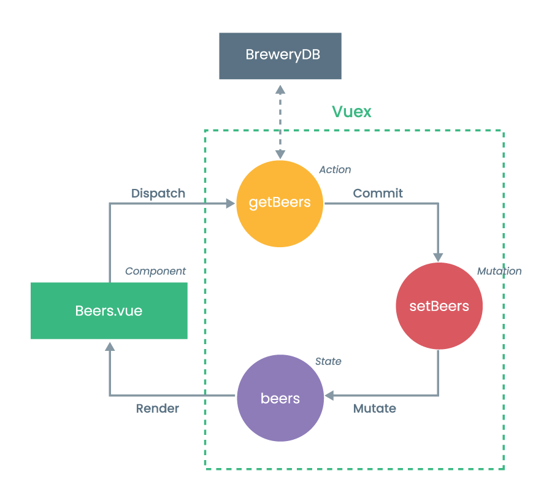

# Beer Collection 🍺

* [Run Project](#run-project)
* [Folder Structure](#folder-structure)
* [About](#about)
  * [How It Works](#how-it-works)
* [Further Development](#further-development)
  * [TypeScript](#typescript)
  * [Styling](#styling)
  * [Axios POST](#axios-post)
  * [Tests](#tests)
  * [Features and UX](#features-and-ux)
  * [Architecture](#architecture)
  * [Docker](#docker)

## Run Project

This is how you setup the project. You need to make a `.env` file with an environment variable. This has the API key for BreweryDB. You then need to `source` the `.env` file. When you have done that, you can `npm install` and `npm run serve`.

**Setup `.env` file**

```sh
VUE_APP_API_KEY=
```

**Source `.env` file**

```sh
source .env
```

**Project setup**
```
npm install
```

**Run the project**
```
npm run serve
```

## Folder Structure

Here is a list with a description of the content of the folders. I have mostly used the structure from Vue Cli.

* **root**: The root contains all of the configurations like `.gitignore`, `babel.config.js`, `package.json` and `vue.config.js`.
  * **public**: The content of this folder will simply be copied and not go through webpack. This is mainly for `index.html` and static assets `favicon.ico`.
  * **src**: This folder contains all of the main `src` files.
    * **assets**: This folder contains the project’s assets such as `logo.png`.
    * **components**: This folder contains the Vue components.
    * **store**: This folder contains all of the Vuex modules.

## About

I have used the Vue CLI with a basic preset and then added Vuex, Vue Router and Axios.

I chose to use the state management and pattern library Vuex for a centralised store for all components. This project is not that big - but it's nice with a single source of truth for data/state. And we also don't need to pass down props through components.

### How It Works

In this section, I will briefly explain with an example of my use of Vue and Vuex.



We have our `Beers.vue` component, which should contain all of the different beers. From this component, we can dispatch an action with a helper `mapActions`. This action will send a request to the API with `axios`. Then the action will commit a mutation `setBeers`, which will mutate the state with all the beers - and lastly it renders it to the component.

## Further Development

I have written down a few thoughts on possible further development.

### TypeScript

I could have chose to use TypeScript, but it would maybe be too much setup for such a small application.

### Styling

I haven't paid that much attention to styling of the application. I have made a [BEMIT Boilerplate](https://github.com/steffenpedersen/bemit-boilerplate), which could be a possible setup.

I have used CSS Grid on the beers list. Here it would be possible to use CSS Flexbox to control the content. In [this article](https://dev.to/steffenpedersen/css-now-and-the-future-28n3) I have written about CSS Grid and CSS Flexbox. Mosts browsers support these properties, so we don't have to use `@supports` at-rule.

### Axios POST

I wanted to `POST` a request to BreweryDB. I couldn't do that due to restrictions on their API.

```sh
{
    "message": "READ ONLY MODE: The beer has been successfully added and is waiting to be approved by our administrators.",
    "status": "success"
}
```

### Tests

It would be great to make tests and especially integration tests. This should be done to check that we're getting a 200 response from the API. We chould do this with the Mocha test framework.

### Features and UX

This is of course a prototype and the UX is not that great. We could do a tonne of improvements with a few features as pagination and even small features like hover effects.

### Architecture

The Vue.js components easily gets bloated. Here we could seperate the content to different files containing logic, views and styling. It would also be great to seperate main components like `Beers.vue` and partial components like `SingleBeer.vue`, as it will be a mess in the long run.

### Docker

Docker is a tool that makes it easier to run applications by using containers. Containers allow a developer to package up an application with all source code, dependencies, and turn it into one package. I think it's great, because you are able to encapsulate the project and avoid dependency mistakes.

It's also great, if you use services like [TeamCity](https://www.jetbrains.com/teamcity/) to build, test and deploy the project, because you are with the help of Docker creating a stable environment.
